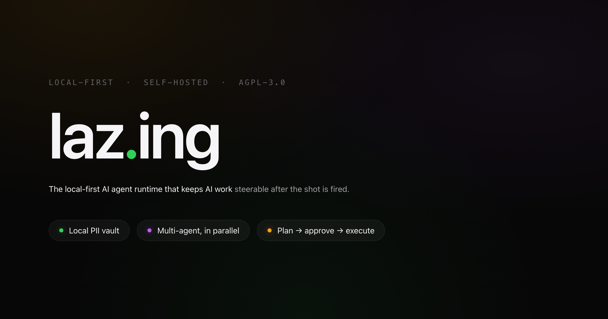
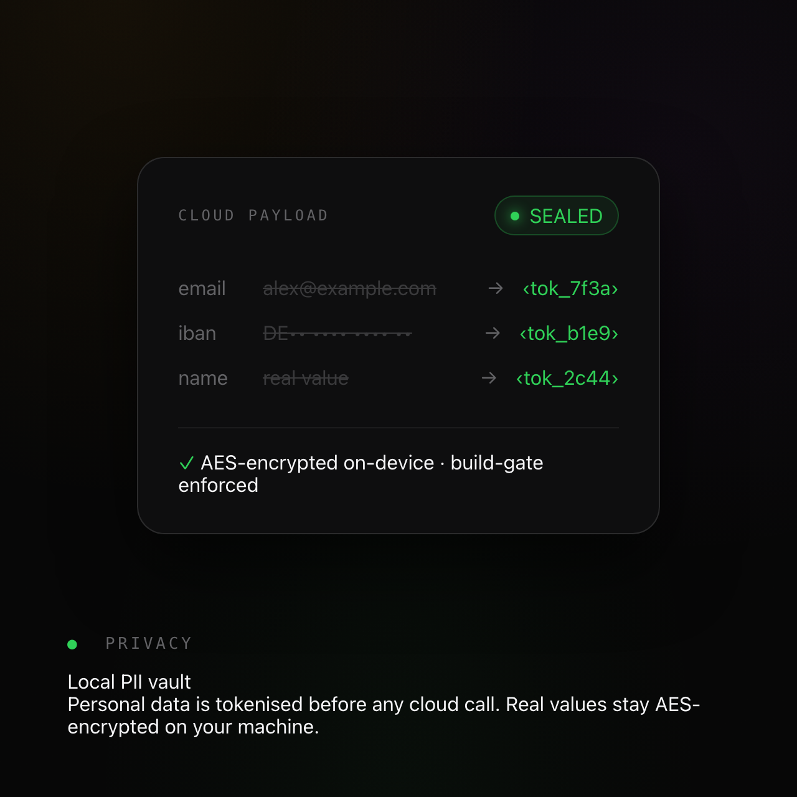

<div align="center">

# laz.ing



### You fire the prompt. You keep the gun.

A local-first AI agent runtime. It runs on your machine, with your data, on your engine — and it lets you correct the work while it's still running. Not a plugin, not a SaaS: it runs in your browser, stores everything in a local SQLite database, and keeps AI work steerable after the shot is fired. Bring your own engine — Claude Code, Codex, Grok, or local Ollama. AGPL-3.0.

```bash
curl -fsSL https://raw.githubusercontent.com/MaximilianGerhardt/lazing/main/install.sh | bash
```

[Why it exists](#why-it-exists) · [The first run](#the-experience) · [What you get](#what-you-get) · [Quickstart](#quickstart) · [Architecture](#architecture) · [Configuration](#configuration) · [License](#license)

</div>

---

## Why it exists

There's a moment, right after you send a prompt to an AI agent, where you let go.

You watch a wall of text scroll past. You can't stop it, you can't bend it, and you don't actually *know* what it's doing — you just know that in thirty seconds you'll get either a small miracle or a confident mess. So you sit there and hope.

Two problems, one cause. You can't steer an agent after you start it — your only move is to throw the result away and fire again. And to reach the best models, you ship your work to someone else's computer: client contracts, half-formed strategy, names and numbers you'd never say in a crowded room. We were told this was the price of intelligence.

laz.ing refuses the trade. Capable cloud models, your hands on the controls, your private work on hardware you own — all at once.

> **Mid-course correction is an architectural primitive here**, not a feature bolted on afterward. You see the plan, and you can adjust the aim while it's still in flight. That one idea is the spine everything else hangs from.

---

## The experience

Three moments. This is what it actually feels like to use it.

### 1 — The first run takes care of itself

One line. You paste it, you press enter, and instead of a stack trace and a README scavenger hunt, the thing checks itself, fixes what's missing, and opens in your browser already knowing who you are. You're the owner of this machine — so on localhost there's no account and no gate: one click and you're in.

The first feeling is: *this respects my time.*

### 2 — Your first steerable agent

You throw in something real. Agents spin up — in parallel, each isolated in its own session — and a plan starts to form in front of you. And then it stops. Before the next move, it waits. For you. You read the plan, you spot the one wrong assumption, you sharpen it — and the work bends to your correction instead of starting over.

This is the moment people stop trusting any tool that won't let them do it. You weren't a spectator. You were holding the controls the whole time.

### 3 — It runs, privately, and you stop thinking about it

The plan runs. Sub-tasks fan out into their own workstreams. Routines you set once run on their own schedule; a notification reaches you only when something needs your approval. And — when you turn it on — the part you forget is happening underneath: personal data is tokenized and locked in an encrypted vault on *your* machine before a single byte reaches a cloud model, with a build-gate test that fails the build if any cloud path could bypass it.

> **In practice:** a 40-minute contract-review run, redirected twice mid-flight without a restart, on a laptop where the client's name never once left the disk.

<div align="center">

&nbsp;&nbsp;

<sub>Local PII vault · Several agents at once · Plan → Subplan</sub>

</div>

---

## What you get

These three are the things only laz.ing can claim. The rest of the surface — engine fallback, one-command install, the audit trail — lives in [Architecture](#architecture) and the docs below.

### Stay in command mid-run

Long flows pause at an explicit inject point, so you can pause, correct, or redirect an agent while it's still working — without restarting from zero or babysitting a chat window. This is the sniper thesis, made real: you keep your hands on the shot after it's fired. (`SniperInjectCard.tsx` → `app/api/workstreams/[id]/inject/route.ts`.)

### Keep client data on your machine

An optional local **PII vault** detects structured personal data — emails, IBANs, card and phone numbers — and replaces it with opaque tokens **before** any cloud LLM call, then decrypts the reply locally. (Free-text names are caught too, if you switch on the optional local-model layer.) The real values are AES-256-GCM-encrypted on your machine and scoped to one workspace, so one client's data can never be detokenized inside another's.

Use top cloud models. Your clients' data never reaches them. This is not a promise — the build fails if any cloud path could leak around the vault. (See [`lib/privacy/__tests__/egress-guard.test.ts`](lib/privacy/__tests__/egress-guard.test.ts) — a real test a builder can open.)

> The vault is **off by default** — pure pass-through until you switch it on. Turn it on with `LAZYOS_PII_VAULT=on` plus a `LAZYOS_CREDENTIAL_KEY`. When it's on, raw personal data does not leave your machine; when it's off, prompts go to the engine unchanged. We'd rather tell you exactly where the line is than overstate the default.

### See why the agent decided what it did

Every state change is appended to an event log that acts as the source of truth, and decisions, sources, and corrections are recorded alongside it — traceable, not just logged. So when an agent makes a call you didn't expect, you can open the trail and read the reason instead of guessing.

---

## Quickstart

**One line.** Needs git and Node ≥ 20. It enables pnpm for you, clones, launches both servers, and opens your browser:

```bash
curl -fsSL https://raw.githubusercontent.com/MaximilianGerhardt/lazing/main/install.sh | bash
```

That's it — the browser opens on **"Get started."** You're the owner of this machine, so on localhost it's one click, no access code. The first-run onboarding wizard takes over from there: system check, one-click engine install, connect Claude/Codex, choose a main folder, and the phone QR + PWA step.

**Already have the repo?** Run the launcher:

```bash
git clone https://github.com/MaximilianGerhardt/lazing.git && cd lazing && ./start
```

`./start` is idempotent. It runs `scripts/setup.sh` (creates `.env.local` and auto-generates the required secrets `LAZYOS_AUTH_SECRET` / `LAZYOS_CREDENTIAL_KEY` / `LAZYOS_ACCESS_CODE`, defaults the owner e-mail to `owner@localhost`, and never overwrites real values you've set), applies migrations and seed, boots the web app (`:4200`) **and** the agent server (`:4201`), waits until the web app is up, and opens your browser. Ctrl-C stops everything.

<details>
<summary>Prefer to run the steps yourself?</summary>

```bash
git clone https://github.com/MaximilianGerhardt/lazing.git
cd lazing
pnpm install
bash scripts/setup.sh                       # secrets + migrations + seed (idempotent)
pnpm dev                                     # web app on http://localhost:4200
cd server && pnpm install && pnpm start      # agent server on :4201 (separate terminal)
```
</details>

**Remote / other users.** The codeless owner setup is localhost-only. Over a tunnel, sign in with the access code (`LAZYOS_ACCESS_CODE`, in `.env.local`) or an e-mail magic-link — both under "Other ways to sign in."

More detailed guides live under [`docs/install/`](docs/install/): [local](docs/install/local.md), [Docker](docs/install/docker.md), [public/tunnel](docs/install/public.md), and [VPS](docs/install/vps.md). There's also an in-product tour at `/how` once the app is running.

---

## Architecture

- **Stack:** Next.js 16 (App Router) · TypeScript (strict) · Drizzle ORM · SQLite (Postgres optional) · React 19.
- **Event-sourced core:** state changes are appended to an event log that acts as the source of truth, with an audit trail over decisions, sources, and corrections.
- **Multi-engine, no lock-in:** Claude Code, Codex, Grok, and local Ollama run side by side, with automatic fallback when one is unavailable — the chain is visible, so you can see exactly which engine answered. Connections are org/workspace-isolated, MCP included.
- **Plan-before-execute:** a complex intent is decomposed into a plan and subplans you review before a single command runs, then dispatched into isolated workstreams once you approve.
- **Two processes:** the Next.js web app (default port `4200`) and an optional long-running agent server (default port `4201`) that hosts real CLI agent sessions.

Repository layout:

| Path | What |
|---|---|
| `app/` | Next.js App Router routes |
| `app/api/` | REST endpoints (Node runtime unless explicitly Edge) |
| `lib/` | Shared client + server logic (chat, workspaces, orgs, privacy, mail, tickets, workstreams, agents) |
| `lib/privacy/` | The PII vault, the protect boundary, and the egress build-gate test |
| `lib/llm/engines/` | Multi-engine layer — `claude-cli`, `codex`, `grok`, `ollama`, `selector`, fallback chain |
| `server/` | Long-running agent process (port 4201) |
| `db/` | Drizzle schemas + idempotent SQL migrations |
| `scripts/` | One-shot CLIs (setup, seed, deploy, watchdog, image rendering) |
| `docs/` | Install guides, architecture notes, ADRs |

---

## Configuration

All configuration is via environment variables. Copy the template and fill it in:

```bash
cp .env.example .env.local
```

[`.env.example`](.env.example) documents every variable the shipped code reads, grouped into **REQUIRED**, **PATHS**, **BRAND/MODE/RUNTIME**, **ENGINES/LLM**, **AGENT SERVER**, **OPTIONAL INTEGRATIONS** (GitHub OAuth, e-mail, web push, speech-to-text, VPS bridge, the PII vault), and **DEV/TEST ONLY**.

The four you must set for a working install:

| Variable | What |
|---|---|
| `LAZYOS_AUTH_SECRET` | HMAC secret for session cookies. ≥ 32 random bytes (hex). |
| `LAZYOS_ACCESS_CODE` | Operator bootstrap / solo-self-host login code. ≥ 16 chars. Treat like a root password. |
| `LAZYOS_CREDENTIAL_KEY` | AES-256-GCM key for credentials (and, when enabled, the PII vault) at rest. 64 hex chars. |
| `LAZYOS_OWNER_EMAIL` | Founder e-mail (used by the setup script). |

To turn on client-data protection, additionally set `LAZYOS_PII_VAULT=on`. It is off by default.

---

## Development

```bash
pnpm dev                          # web app on 4200
cd server && pnpm start           # agent server on 4201 (separate terminal)
pnpm tsc --noEmit                 # type-check
pnpm test                         # test suite
pnpm build                        # production build
pnpm start                        # production start
```

Ops unit templates for self-hosters (systemd timers/services, a macOS launchd plist) live under [`systemd/`](systemd/), [`systemd-units/`](systemd-units/), and [`launchd/`](launchd/). Adjust the install paths to your environment before use.

---

## License

Licensed under the **GNU Affero General Public License v3.0 or later** ([AGPL-3.0-or-later](LICENSE)). Because the AGPL covers network use, if you run a modified version of laz.ing as a network service, you must offer its source to your users.

## Contributing

Contributions are welcome — see [CONTRIBUTING.md](CONTRIBUTING.md). The guiding rule for any new long-running flow: *"Where can a human intervene without aborting the plan?"*

## Security

Please report vulnerabilities privately — see [SECURITY.md](SECURITY.md). Do not open a public issue for security findings.

## Code of Conduct

This project follows the [Contributor Covenant](CODE_OF_CONDUCT.md).

---

> **A note on the name.** The brand is **laz.ing**. The code-identifier prefix `lazyos` — the `LAZYOS_*` environment variables, the `lazyos` package name, DB identifiers, systemd unit names — is a legacy schema kept unchanged for backward compatibility. Wherever you see `lazyos` in code or config, read "laz.ing".

<sub>Created by Maximilian Gerhardt · laz.ing · pre-1.0 · `lazyos` is the legacy code identifier behind the laz.ing brand.</sub>